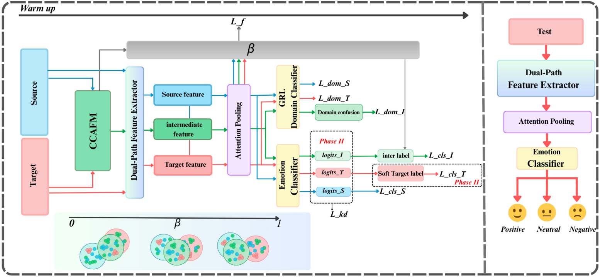

# CARAF-Net

Official code implementation of **[BICS 2025 Oral] Cross-Subject EEG Emotion Recognition via Adaptive Representation and Attention Fusion**.

*Siyuan Gao, Shuheng Hu, Zhao Wang, Yumei Luo, Fangyu Wu*

## Overview

Individual differences between subjects cause domain shift, which makes cross-subject EEG emotion recognition hard. Unsupervised domain adaptation methods that align source and target directly tend to be rigid and do not give a smooth transition between the two. **CARAF-Net** (Channel-level Adaptive Representation and Attention Fusion Network) adds a **dynamic intermediate domain** that connects the source and target subjects. The network has three parts:

1. **Channel-wise Cross-Attention Feature Fusion Module (CCAFM).** Processes each frequency band separately. It uses asymmetric cross-attention, with target features as queries and source features as keys and values. An adaptive gating network then fuses the result into intermediate-domain samples.
2. **Dual-Path Feature Extractor (DPFE).** A temporal path uses a Convolutional Gated State Block, and a spatial path uses a Graph Attention Block with electrodes as graph nodes. A bidirectional cross-attention fusion combines the two paths.
3. **Adaptive Adversarial Learning.** A domain discriminator labels source, target and intermediate samples as 1, 0 and 0.5. An emotion classifier is trained with a two-phase schedule: a warm-up phase, then adaptive refinement. The training objective combines classification, adversarial alignment, feature consistency and knowledge-distillation losses.

<p align="center">
  
</p>

## Results

Leave-one-subject-out evaluation:

| Dataset | Classes | Accuracy |
|---|---|---|
| SEED    | 3 (positive / neutral / negative) | **89.05%** |
| SEED-IV | 4 (happy / sad / fear / neutral)  | **76.30%** |

## Repository Structure

```
├── main.py                 # Entry point: leave-one-subject-out training loop
├── train.py                # Training procedure (trainCARAF)
├── model.py                # CARAF-Net model, domain discriminator, losses
├── CCAFM.py                # Channel-wise Cross-Attention Feature Fusion Module
├── Convolutionalgated.py   # Temporal path: Convolutional Gated State Block
├── Graphattention.py       # Spatial path: Graph Attention Block
├── Crossfusion.py          # Cross-attention fusion of the two paths
├── preprocess.py           # Data loading, sliding window, normalization
├── test.py                 # Evaluation helper
├── test_seed3.py           # Evaluate saved models on SEED (metrics + confusion matrices)
├── test_seed4.py           # Evaluate saved models on SEED-IV
└── requirements.txt
```

## Requirements

Python 3.8+ is recommended.

```bash
pip install -r requirements.txt
```

## Data Preparation

Get [SEED and SEED-IV](https://bcmi.sjtu.edu.cn/home/seed/) from BCMI (SJTU). The code uses the provided **DE features smoothed by LDS** (the `de_LDS*` keys in the `.mat` files), with 62 channels × 5 bands = 310 dimensions. Put the files in session folders:

```
{data_path}/
├── SEED/
│   ├── 1/        # session 1: 1_xxx.mat, 2_xxx.mat, ..., 15_xxx.mat
│   ├── 2/
│   └── 3/
└── SEED-IV/
    ├── 1/
    ├── 2/
    └── 3/
```

Then replace `{data_path}` in `main.py`, `test_seed3.py` and `test_seed4.py` with your own data directory:

```python
args.seed3_path = "{data_path}/SEED/"
args.seed4_path = "{data_path}/SEED-IV/"
```

## Usage

Training (leave-one-subject-out over all 15 subjects):

```bash
python main.py --dataset_name seed3 --session 1
python main.py --dataset_name seed4 --session 1
```

The best checkpoint for each target subject is saved as `best_model_{dataset}_subject_{id}.pth`. Per-epoch test accuracy is logged in `log2s/`.

Evaluation of the saved checkpoints:

```bash
python test_seed3.py
python test_seed4.py
```

## Citation

```bibtex
@inproceedings{gao2025caraf,
  title     = {Cross-Subject EEG Emotion Recognition via Adaptive Representation and Attention Fusion},
  author    = {Gao, Siyuan and Hu, Shuheng and Wang, Zhao and Luo, Yumei and Wu, Fangyu},
  booktitle = {Proceedings of the International Conference on Brain Inspired Cognitive Systems (BICS)},
  year      = {2025}
}
```
